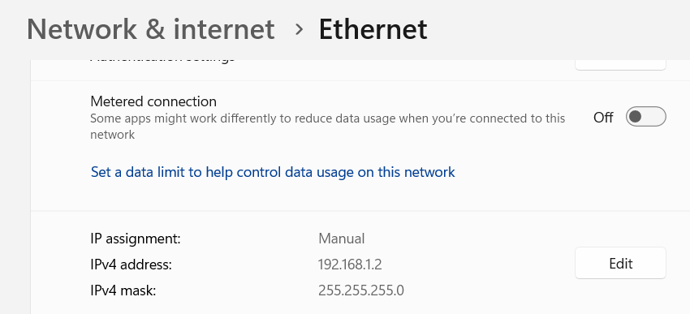

## Notes 
[integration] top-level (fcs_control)has to make sure nothing is written into data_fifo and crc_calculator if data_fifo is full. If conditional on input

[future]  We assume that i_rx_ctrl behaves correctly (no glitches). However if a glitch were to happen it wouldn't cause system failure in the PAYLOAD stage, but it would crash if it happened in DST_MAC or SRC_MAC. As status and length FIFOs are only written in PAYLOAD. TODO Maybe add writing to FIFOs in the global abort conditional. Michael said not to worry about this in the beginning.

[testing:mac_learner] When deciding whether to create new entry the MAC Learner should check if the src_mac AND src port are the same. CASE: Port0 is unplugged and then plugged into Port2. The client will send something so the MAC Learner should be able to rewrite the look-up entry if the port changes. 

[testing:fcs_control] The FIFOs in `fcs_control` should never fill up. Monitor `fifo_full` signals in the big test.

[testing:crossbar] The `crossbar` should check packet length before writing it into its FIFOs. CASE: All input ports streaming to one output port - The crossbar must take only full packets and not take partial packets which will make it transmit nothing.

## TODO
- Add two dff synchronizer for reset
- Adjust block diagrams to fit the real thing
- Debug switch on fpga with 

---

## 2026-04-08
### Did

- Changed data_fifo size 4096→2048 and status/length sizes to fit for that. Adjusted fcs_control/README.md. The change was Michael's suggestion - now the data fifo fits one max size packet 1518 byte plus ~500 bytes of buffer room.
- Created FIFOs for SRC and DST mac addresses.
- Integrate SRC and DST FIFOs into crc_calculator and update the tb.


### Next
- Change the block diagram to include src and dst FIFOs.

## 2026-04-15
### Did
- Implemented `output_control.sv`
- Implemented `fcs_control.sv` to integrate the components.
- TESTED `fcs_control.sv`:
    - Sent single packet
    - Sent two packets in parallel

## TODO
- Send packet with bad CRC

## 2026-04-22
### Did
- Fixed reset to be active-low in all modules (currently mixed sync and async)
- Got direct connected example to work on DE-4 FPGA. Needed to set Ethernet IP to static. And enable a rule in the Windows firewall.

## 2026-05-06
### Did
1. Setup ping to work between two directly connected computers (see [Setup for PING](#setup-for-ping)).
2. Found that the Ethernet PHY gives the packet including the preamble and start-of-frame delimiter. Added a fix in `crc_calculator.sv` to ignore the first 8 bytes for crc calculation, but include them in `packet_length` as they are still stored in the `data_fifo`. 🔵 PUT IN REPORT: Could exclude preamble+start-of-frame delimeter out of the `data_fifo` and then put it back on before transmitting. This is a minor optimization.
3. Ethernet uses `CRC32` (input and output bit-reflected), while our `crc_calculator` implements `CRC32_BZIP2` (no reflection). To compensate, we feed data into the calculator with bit order reversed. This also means dst and src MAC addresses for the MAC learner arrive with reversed bit order. Ordering in the `data_fifo` is unchanged. 🔴 TODO: Make sure the broadcast bit is taken from the right place.

## Setup for PING WINDOWS

1. Set a static IP. See picture below.




2. Enable the following `Inbound Rules` in the `Windows Defender Firewall`


3. Set a MAC address to a static IP (so the computer knows what dst_mac to use when pinging)

Daniel's IP below
```
arp -s 192.168.1.3 00-E0-4C-68-00-93
```
Amal's IP
```
arp -s 192.168.1.3 C8-09-A8-09-19-9B
```
My IP
```
arp -s 192.168.1.2 AC-1A-3D-B0-2D-FF
```

Get the IP by using
```
ipconfig /all
```
MAKE sure it's the MAC address from Ethernet and not virtual Ethernet or WSL Ethernet
To lists IPs and correspondig MACs
```
arp -a 
```
## Setup for PING LINUX
```
ip link show
sudo ip addr add 192.168.1.20/24 dev <insert eth interface here>
sudo ip link set <insert eth interface here> up
ip route  # shows a route for your subnet
```

## Testing commands

Ping max length (WINDOWS)
```
ping -t 1472 192.168.1.20
```

UDP:
```
iperf3 -s
 iperf3 -c 192.168.1.20 -u -b 1G -l 1024
```

TCP:
```
iperf3 -s
iperf3 -c 192.168.1.20 -t 10
iperf3 -c 192.168.1.20 -t 10 -l 1400 -w 256K

```

## 2026-05-13
### Did

- Ping works
- Ping with max size (1472 bytes) also works
- UDP stream at 1GB works with 64, 128, 256, 1024 and 1400 packet sizes. (pictures in `figures/`)


## 2026-05-13
### Did
- TCP still does not work. Could it be due to too large packets?
- Running `iperf3 -c 192.168.1.20 -u -b 1G -l 1472` the receiver side says all packets are being lost. If the overhead is too big and the allowed payload size is exceeded it should be dropping everything. After `Ctrl+C` out of this transmission ping does not work anymore, why doesn't the switch recover?

The bellow TCP setup works (used -M to set the MSS (Maximum Segment Size)).
```
 iperf3 -c 192.168.1.20 -t 10 -M 1340
 ```
 This would give 1340 (data) + 20 (TCP) + 20 (IP) + 18 (Ethernet) = 1398 bytes on the wire

 Where the Ethernet part of the header is SRC_MAC(6)+DST_MAC(6)+ETH_TYPE(2)

 For the data FIFO it is also +8 for the preamble and start-of-frame delimiter (not part of packet rejection though)

FOR TCP
So the maximum `-M` value for TCP transmission will be 1518-18-20-20=1460

FOR UDP
Maximum `-l` value is 1518-18-20(IP)-8(UDP)=1472 (VERIFIED) 


Abort logic was wrong used to keep collecting bytes in data FIFO even after aborting in crc_calculator. Added an `abort` signal to gate WEN into data FIFO. In simulation found that flushing the FIFO